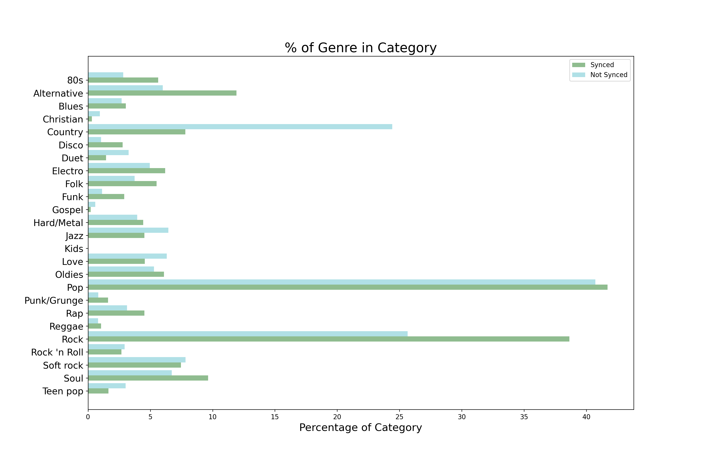
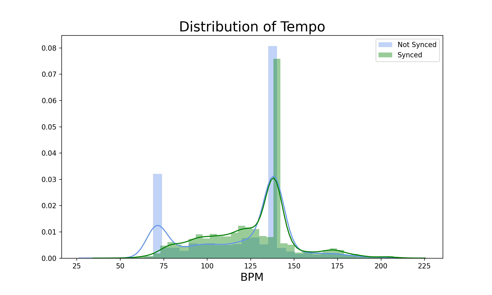
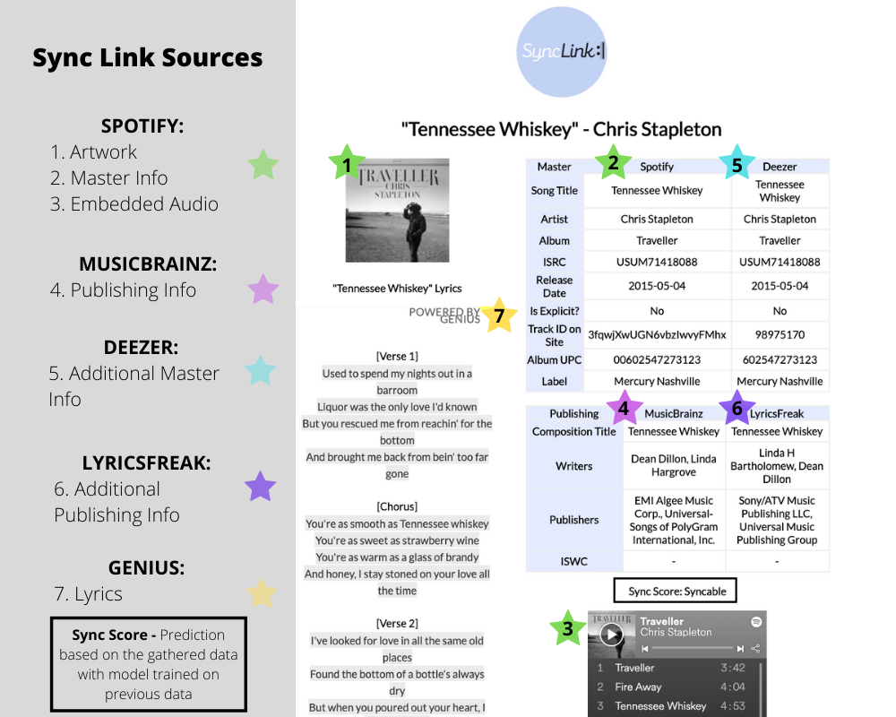

# Sync Link

There are often lots of discrepancies when researching music rights online. In my experience, one of the best ways to combat this is to check as many sources as possible. However,  this can be very time consuming (and frustrating). For this project, I wanted to create a better way to search. 

“Sync Link” aims to link multiple sources together to create a dashboard of master/publishing info and more! It utilizes APIs from Spotify, Genius, Deezer, and MusicBrainz in conjunction with web scraping additional sites to return two master sources, two publishing sources, lyrics, artwork, and embedded audio in one click. It also uses a Random Forests model to classify and predict the “clearability” of a song based on a dozen key features. 

##### Overview: [1A. What-Song (Scrape)](https://github.com/scaress21/sync_link/blob/master/code/01A_Gathering_Data_What-Song(Scrape).ipynb) | [1B. Building the Dataset](https://github.com/scaress21/sync_link/blob/master/code/01B_Gathering_Data_Random_Sample.ipynb) | [1C. Deezer (Master)](https://github.com/scaress21/sync_link/blob/master/code/01C_Gathering_Data_Deezer(API).ipynb) | [1D. LyricsFreak (Publishing)](https://github.com/scaress21/sync_link/blob/master/code/01D_Gathering_Data_LyricsFreak(Scrape).ipynb) | [1E. Spotify Pt. 1](https://github.com/scaress21/sync_link/blob/master/code/01E_Gathering_Data_Spotify(API).ipynb) | [1F. Spotify Pt 2.](https://github.com/scaress21/sync_link/blob/master/code/01F_Gathering_Data_Spotify_2(API).ipynb) | [2. Cleaning](https://github.com/scaress21/sync_link/blob/master/code/02_Cleaning.ipynb) | [3. EDA](https://github.com/scaress21/sync_link/blob/master/code/03_EDA.ipynb)  | [4. Modeling](https://github.com/scaress21/sync_link/blob/master/code/04_Modeling.ipynb)

### Problem Statement
Researching song ownership can be very time consuming but is a neccessary step to find out if a song is licensable. How can we speed up the process of finding and analyzing song ownership information?

### Data Overview 
Gathering data was the most time intensive part of this project. This is because I used multiple sources to build it from the ground up. My process is below:
1. Scrape data from What-Song.com.
    - This the basis for the categories. If a song is in here, it's in the "synced" category. If it's not, it's classified as "not synced".
2. Gather songs, both "synced" and "unsynced" 
    - Since "synced" songs should only make up about half of the dataset, I wanted to incorporate a larger set of songs. I used a karaoke catalog for a wide variety of songs in both categories.
3. Gather master info from Deezer
    - Master info gathered included bpm, album, and artist
4. Gather publishing info from LyricsFreak
    - This includes writers and publishers
5. Gather audio features from Spotify
    - These are features Spotify generates off the audio such as "Danceability", "Liveness", etc.

### Exploratory Data Analysis
There were lots of interesting categorial and numerical features to explore. For example, comparing the distribution of genres between the "synced" and "not synced" classes showed that Rock is very popular for uses while Country is not as much. 

We can also see how the classes vary in tempo. They both have a peak around 130bpm but the "not synced" category has a second peak closer to 60bpm. The tempo of a song can have a huge impact on how it interacts with the picture so this was interesting to see!

### Modeling
I tried a variety of classification models including Logistic Regression, Naive Bayes, AdaBoost, Extra Trees, and Random Forests. After modeling with different combinations of features, Random Forests performed the best overall with 70% test accuracy in the final model. This means it accurately classified songs as "synced" or "not synced" 70% of the time.

### Application - Sync Link
My main goal of this project was to turn it into a usable product. I believe lots of music professionals could benefit from a service that gathers multiple resources into one easily accessed place. This application essentially goes through all the steps of my project for an individual song and returns the information and prediction. The screenshot below shows how each source is used. 

Below is a short demo of the app:

### Next Steps
I would love to continue exploring this topic and improving my model/application. I think the biggest hurdle is by getting a larger and more accurate dataset to train the model on. There are lots of syncs that are not documented online so right now the model is limited to learning uses that have caught enough attention to be recorded by the public. 

Also, there's a lot of nuance in determining whether or not a song is clearable, only some of this information is openly available and included here. I would love to do more reserach to see what other avenues are available to capture more levels of detail. 

Thanks for taking the time to read about my project!
